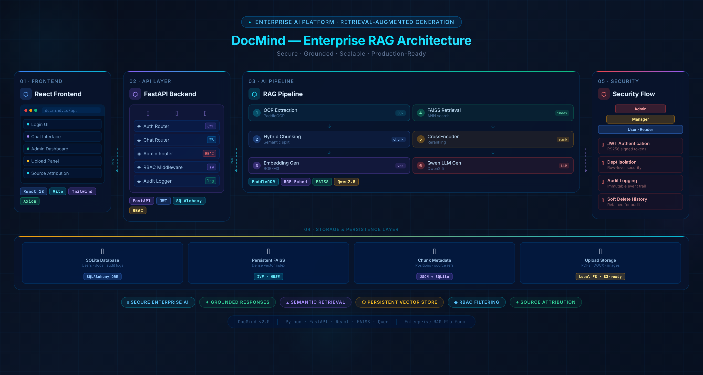
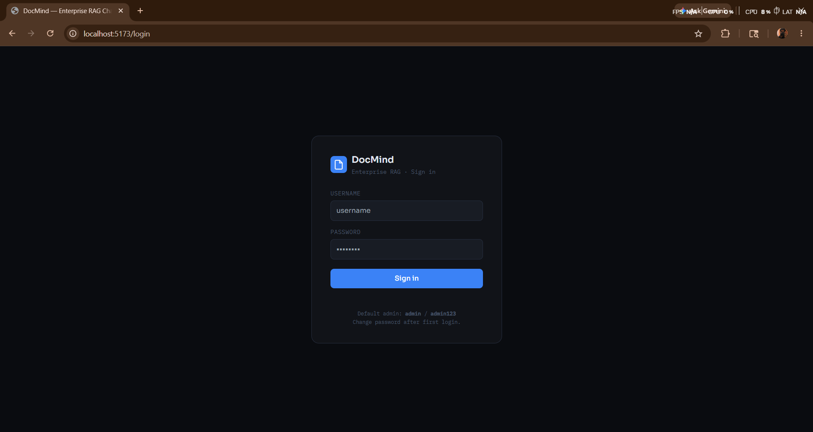
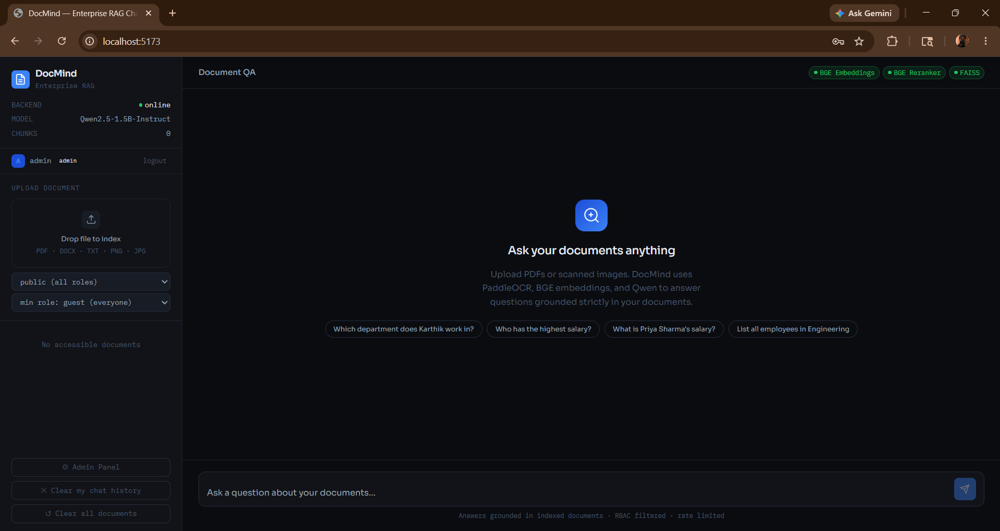
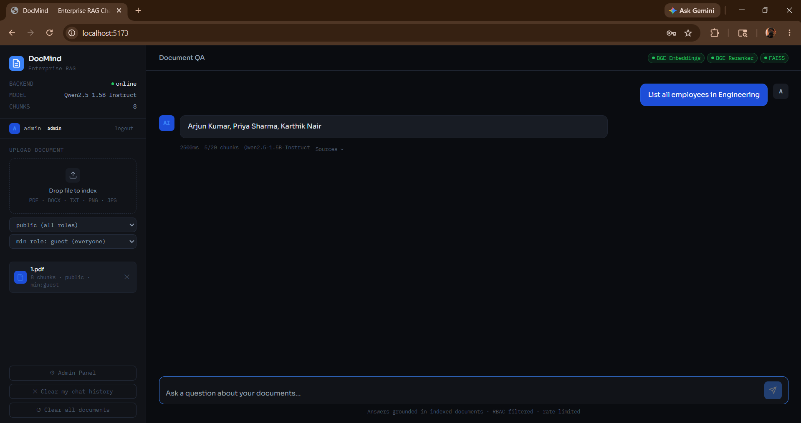
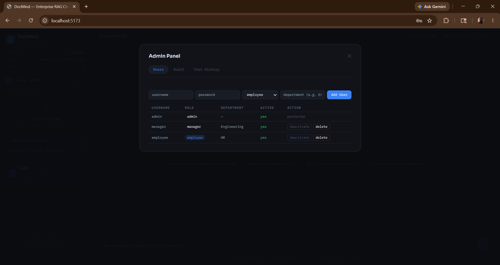
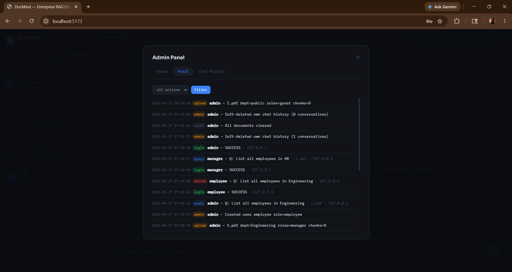
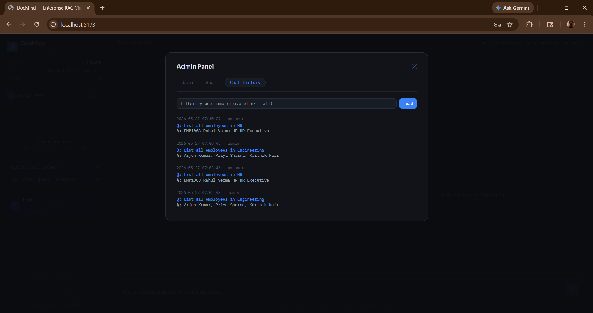
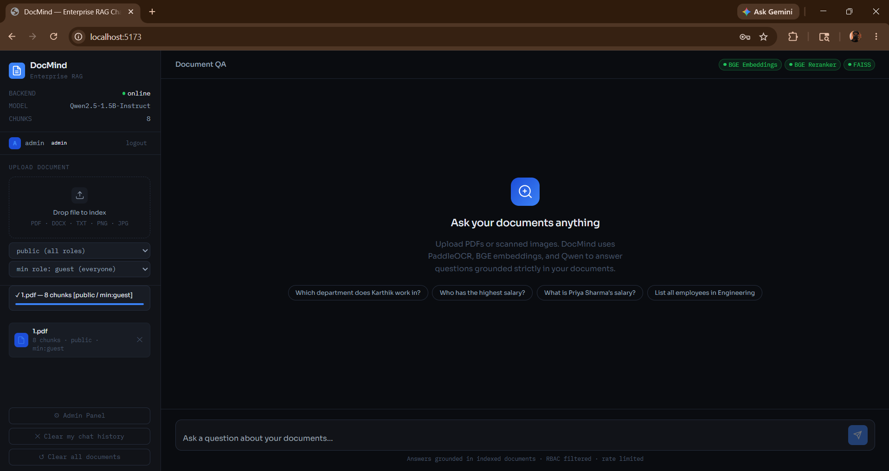

<div align="center">

# 🧠 DocMind

### Enterprise RAG Chatbot — Secure Document Intelligence with RBAC, FAISS, and LLM-Grounded Answers

[](https://python.org)
[](https://fastapi.tiangolo.com)
[](https://react.dev)
[](https://vitejs.dev)
[](https://tailwindcss.com)
[](https://github.com/facebookresearch/faiss)
[](LICENSE)

> An end-to-end enterprise document Q&A platform. Upload PDFs, DOCX, images, or plain-text files — DocMind OCRs, chunks, embeds, and indexes them into a persistent FAISS vector store. Users query documents in natural language; answers are grounded strictly in uploaded content and filtered by a two-gate RBAC system (role hierarchy + department).

</div>

---

## 📑 Table of Contents

- [Features](#-features)
- [STAR Method Explanation](#-star-method-explanation)
- [Architecture](#-architecture)
- [Folder Structure](#-folder-structure)
- [Tech Stack](#-tech-stack)
- [RBAC Security Model](#-rbac-security-model)
- [Screenshots](#-screenshots)
- [Installation Guide](#-installation-guide)
- [Environment Variables](#-environment-variables)
- [API Endpoints](#-api-endpoints)
- [Security Features](#-security-features)
- [Future Improvements](#-future-improvements)
- [Portfolio Value](#-portfolio--resume-value)
- [License](#-license)

---

## ✨ Features

| Category | Capability |
|---|---|
| 🔍 **RAG Pipeline** | FAISS semantic retrieval → CrossEncoder reranking → Qwen LLM generation |
| 🗄️ **Vector Store** | Persistent FAISS `IndexFlatIP` with pickle-serialised chunk metadata; survives server restarts |
| 🤖 **LLM** | Qwen2.5-1.5B-Instruct (configurable); GPU-accelerated via `torch.float16`, CPU fallback |
| 📄 **OCR Ingestion** | PaddleOCR on scanned images and image-based PDF pages; hybrid text+OCR extraction |
| 🔐 **JWT Auth** | HS256 bearer tokens, bcrypt password hashing, configurable expiry |
| 👥 **RBAC** | Dual-gate: role hierarchy (admin → manager → employee → guest) + department assignment |
| 🛡️ **Admin Panel** | Full user management, document upload/delete, audit log viewer, chat history inspector |
| 📊 **Audit Logging** | Immutable DB-backed log of every login attempt, query, upload, delete, and admin action with IP capture |
| 📁 **Upload System** | Admin-controlled document ingestion; per-file department + allowed-role metadata enforced at chunk level |
| 💬 **Conversation History** | Persistent per-user conversation storage; soft-delete preserves admin audit trail |
| 🔗 **Source Attribution** | Every answer surfaces grounded sources with document name, department, rerank score, and text snippet |
| ⚡ **Rate Limiting** | 20 queries/minute per IP via `slowapi`; 429 errors surfaced gracefully in the UI |
| 🎨 **React Frontend** | Dark-mode SPA with Context API auth, custom hooks, polling status bar, auto-resize textarea |
| 📦 **Hybrid Chunking** | Structured chunking splits table rows (pipe/tab/multi-space) differently from prose; deduplication pass |

---

## ⭐ STAR Method Explanation

### Situation
Enterprise organisations manage large volumes of internal documents — HR policies, engineering specs, financial reports — across multiple departments with different access requirements. Employees frequently struggle to find answers buried in PDFs or scanned images, and ad-hoc solutions (shared drives, keyword search) fail to provide context-aware, role-restricted responses.

### Task
Design and build a production-grade Retrieval-Augmented Generation (RAG) chatbot that could:
- Ingest heterogeneous document formats including scanned PDFs and images (requiring OCR)
- Chunk and semantically index content into a persistent vector store
- Answer natural-language queries **grounded strictly in indexed documents** — no hallucination
- Enforce access control at the chunk level so sensitive departmental content is never exposed to unauthorised roles
- Provide administrators with full visibility via audit logs, user management, and a document lifecycle UI

### Action

**Architecture decisions:**
- **FastAPI + lifespan events** for controlled model loading at startup (PaddleOCR, SentenceTransformer BGE, CrossEncoder, Qwen LLM) and graceful shutdown
- **Persistent FAISS `IndexFlatIP`** (inner-product / cosine similarity after `normalize_embeddings=True`) serialised to disk on every upload and delete — the vector store survives server restarts without re-indexing
- **Hybrid chunking strategy**: table rows (detected by pipe/tab/multi-space patterns) are preserved as discrete chunks to maintain row-level semantics; prose is split with LangChain's `RecursiveCharacterTextSplitter` (chunk_size=400, overlap=60)
- **Two-gate RBAC**: Gate 1 uses a role hierarchy dict (`admin > manager > employee > guest`) — a user "acts as" all roles below theirs. Gate 2 enforces department matching — a chunk tagged `finance` is inaccessible to a user not assigned to `finance`, even if their role would otherwise permit it. Admins bypass both gates
- **Soft-delete conversations**: users "deleting" their history sets a `hidden_for` column; admin audit trail is never physically destroyed
- **CrossEncoder reranking**: FAISS retrieves top-20 candidates; `BAAI/bge-reranker-base` rescores them; top-5 are passed to the LLM — dramatically improving answer quality over raw vector similarity

**Security design:**
- JWT tokens signed with HS256, bcrypt-hashed passwords, admin-only endpoints protected by a dedicated `require_admin` dependency
- Upload endpoint validates role labels against a whitelist (`VALID_UPLOAD_ROLES`) and canonicalises department strings to prevent injection of auto-detected labels that could cause department leakage
- All admin actions, login attempts (success and failure), queries, and document lifecycle events are written to an immutable `AuditLog` table with timestamp and IP

**Frontend:**
- React 18 SPA with Context API for auth state and session restoration from `localStorage`
- Three custom hooks: `useChat` (message state + optimistic thinking bubble), `usePolling` (status bar refresh), `useAuth` (JWT lifecycle)
- `ProtectedRoute` component redirects unauthenticated users; admin-only UI surfaces conditionally based on role
- `SourcePanel` expands inline to show grounded document snippets with rerank scores per answer

### Result
A fully functional, self-hostable enterprise RAG platform demonstrating:
- End-to-end LLM engineering (OCR → chunking → embedding → retrieval → reranking → generation)
- Production-grade security patterns (JWT, RBAC, audit logging, soft-delete)
- Full-stack architecture skills (FastAPI + React + SQLite + FAISS)
- Deployable on a single server with persistent state, no external vector DB required

---

## 🏗️ Architecture

### System Overview

```
┌─────────────────────────────────────────────────────────┐
│                     React SPA (Vite)                    │
│  AuthContext  │  useChat  │  usePolling  │  AdminModal  │
└──────────────────────┬──────────────────────────────────┘
                       │  HTTP + Bearer JWT
                       ▼
┌─────────────────────────────────────────────────────────┐
│               FastAPI (uvicorn)                         │
│                                                         │
│  /auth/*   ──► auth.router  (login, /me)                │
│  /chat/*   ──► chat.router  (query, history)            │
│  /admin/*  ──► admin.router (upload, users, audit)      │
│  /status   ──► health + model info (JWT required)       │
│                                                         │
│  Middleware: CORS, slowapi rate-limiter (20 req/min)    │
└──────────┬──────────────────────────────────────────────┘
           │
    ┌──────┴──────────────────────────────────────┐
    │                                             │
    ▼                                             ▼
┌─────────────────┐                   ┌──────────────────┐
│   SQLite DB     │                   │  rag.store (RAM)  │
│                 │                   │                  │
│  users          │                   │  faiss_index     │
│  documents      │                   │  all_chunks[]    │
│  conversations  │                   │  chunk_meta[]    │
│  audit_logs     │                   │  embedding_model │
└─────────────────┘                   │  reranker        │
                                      │  llm + tokenizer │
                                      │  ocr             │
                                      └────────┬─────────┘
                                               │
                                      ┌────────┴──────────┐
                                      │  storage/         │
                                      │  faiss.index      │
                                      │  chunks.pkl       │
                                      └───────────────────┘
```

### RAG Query Lifecycle

```
User Question
      │
      ▼
 [1] JWT auth + RBAC user loaded
      │
      ▼
 [2] SentenceTransformer BGE encode question
      │
      ▼
 [3] FAISS IndexFlatIP.search(embedding, top_k=20)
      │   → returns (scores, indices)
      ▼
 [4] RBAC filter_chunks_rbac()
      │   Gate 1: role hierarchy check
      │   Gate 2: department membership check
      │   → only accessible chunks pass
      ▼
 [5] CrossEncoder bge-reranker-base.predict(pairs)
      │   → rerank accessible chunks, keep top-5
      ▼
 [6] Qwen2.5-1.5B-Instruct generate()
      │   system prompt: "Answer ONLY from context. Do not hallucinate."
      │   → max_new_tokens=256, greedy decoding
      ▼
 [7] Persist Conversation + AuditLog to SQLite
      │
      ▼
 [8] Return { answer, sources[], chunks_used, model_used }
```

### Document Upload & Indexing Pipeline

```
Admin uploads file (PDF / DOCX / TXT / image)
      │
      ▼
 [1] Conflict check — reject duplicate filename (409)
      │
      ▼
 [2] rag.extraction.extract_text()
      │  .pdf  ──► PyMuPDF page.get_text()
      │            └─ blank page? ──► page.get_pixmap() ──► PaddleOCR
      │  .docx ──► python-docx paragraph extraction
      │  .txt  ──► UTF-8 read
      │  image ──► PaddleOCR directly
      ▼
 [3] clean_text() — collapse whitespace
      │
      ▼
 [4] structured_chunking()
      │  table rows (pipe/tab/multi-space) → one chunk per row
      │  prose → RecursiveCharacterTextSplitter (400 chars, 60 overlap)
      │  deduplication via dict.fromkeys()
      ▼
 [5] Append chunks + metadata to store.all_chunks / store.chunk_meta
      │  metadata: { filename, department, allowed_roles, uploaded_by }
      ▼
 [6] build_faiss_index() — re-encode ALL chunks, rebuild IndexFlatIP
      │
      ▼
 [7] persist_vectors() — faiss.write_index + pickle.dump chunks.pkl
      │
      ▼
 [8] INSERT Document row + AuditLog to SQLite
```

### RBAC Filtering Flow

```
chunk_meta = { department: "finance", allowed_roles: ["manager", "admin"] }
user       = { role: "employee", department: "engineering" }

Gate 1 — Role hierarchy:
  ROLE_HIERARCHY["employee"] = ["employee", "guest"]
  chunk allowed_roles = ["manager", "admin"]
  intersection = {}  ──► DENIED ✗

─────────────────────────────────────────────────────────

chunk_meta = { department: "engineering", allowed_roles: ["employee"] }
user       = { role: "employee", department: "engineering" }

Gate 1:
  ROLE_HIERARCHY["employee"] = ["employee", "guest"]
  chunk allowed_roles = ["employee"]
  intersection = {"employee"}  ──► PASS ✓

Gate 2:
  chunk_depts = ["engineering"]
  user_depts  = ["engineering"]
  intersection = {"engineering"}  ──► PASS ✓
  ──► ACCESSIBLE ✓

─────────────────────────────────────────────────────────

admin bypasses both gates unconditionally ──► always ACCESSIBLE ✓
```

---

## 📁 Folder Structure

```
pdf_chatbot/
├── backend/
│       ├── main.py                  # FastAPI app factory, lifespan, startup hooks
│       ├── auth/
│       │   ├── router.py            # POST /auth/login, GET /auth/me
│       │   ├── security.py          # bcrypt hashing, JWT create/decode
│       │   └── dependencies.py      # get_current_user, require_admin, ROLE_HIERARCHY
│       ├── chat/
│       │   └── router.py            # POST /chat/query, GET/DELETE /chat/conversations
│       ├── admin/
│       │   └── router.py            # Upload, documents, users, audit, reset
│       ├── rag/
│       │   ├── store.py             # Shared mutable namespace (index, chunks, models)
│       │   ├── extraction.py        # PDF/DOCX/image/TXT text extraction + OCR
│       │   ├── chunking.py          # Hybrid structured + prose chunking
│       │   ├── indexing.py          # FAISS build + disk persistence
│       │   └── department.py        # Department utilities
│       ├── services/
│       │   ├── rbac.py              # Two-gate RBAC enforcement
│       │   └── audit.py             # Audit log helper
│       ├── db/
│       │   └── database.py          # SQLAlchemy ORM models + session
│       └── utils/
│           ├── config.py            # Env-var driven configuration
│           └── logger.py            # Structured logger
│
├── frontend/
│       ├── index.html
│       ├── vite.config.js
│       ├── tailwind.config.js
│       ├── package.json
│       └── src/
│           ├── App.jsx              # Router + AuthProvider wrapper
│           ├── api.js               # Axios instance + all API calls
│           ├── main.jsx
│           ├── context/
│           │   └── AuthContext.jsx  # JWT storage, session restore, login/logout
│           ├── hooks/
│           │   ├── useChat.js       # Message state, send, history, soft-delete
│           │   ├── useAuth.js       # Auth context accessor
│           │   └── usePolling.js    # /status polling for sidebar
│           ├── pages/
│           │   ├── Login.jsx
│           │   ├── Chat.jsx         # Main chat layout (grid: sidebar + main)
│           │   └── NotFound.jsx
│           ├── components/
│           │   ├── AdminModal.jsx   # Tabbed admin panel (Users / Audit / History)
│           │   ├── Header.jsx
│           │   ├── Sidebar.jsx      # Document list, status, nav
│           │   ├── MessageBubble.jsx
│           │   ├── SourcePanel.jsx  # Collapsible source attribution per answer
│           │   ├── UploadBox.jsx    # Drag-and-drop upload with progress
│           │   ├── LoadingDots.jsx
│           │   ├── ProtectedRoute.jsx
│           │   └── StatusBar.jsx
│           ├── utils/
│           │   ├── constants.js     # API_BASE, sample questions, audit actions
│           │   └── helpers.js       # Badge classes, model name shortener
│           └── styles/
│               └── globals.css      # CSS custom properties, dark theme tokens
│
├── storage/                         # Auto-created; persisted FAISS index + chunks
│   ├── faiss.index
│   └── chunks.pkl
├── uploads/                         # Auto-created; uploaded source files
├── demo_users.json                  # Optional: seed non-admin demo users
└── docmind.db                       # SQLite database (auto-created)
```

---

## 🛠️ Tech Stack

### Frontend

| Technology | Version | Purpose |
|---|---|---|
| React | 18.3 | UI component framework |
| React Router DOM | 6.23 | Client-side routing, `ProtectedRoute` |
| Axios | 1.6 | HTTP client with JWT interceptor |
| Vite | 5.2 | Build tool + dev server |
| Tailwind CSS | 3.4 | Utility-first styling |

### Backend

| Technology | Version | Purpose |
|---|---|---|
| FastAPI | 0.111 | Async REST API framework |
| Uvicorn | — | ASGI server |
| SQLAlchemy | — | ORM for SQLite models |
| Python-Jose | — | JWT encode/decode (HS256) |
| Passlib + bcrypt | — | Password hashing |
| slowapi | — | Rate limiting (20 req/min) |
| python-multipart | — | File upload support |

### AI / ML

| Technology | Purpose |
|---|---|
| `BAAI/bge-base-en-v1.5` | Dense embeddings (SentenceTransformer) |
| `BAAI/bge-reranker-base` | CrossEncoder reranking of retrieved chunks |
| `Qwen/Qwen2.5-1.5B-Instruct` | Causal LLM for grounded answer generation |
| PaddleOCR | OCR for scanned images and image-based PDF pages |
| LangChain Text Splitters | `RecursiveCharacterTextSplitter` for prose chunking |

### Storage & Vector DB

| Technology | Purpose |
|---|---|
| FAISS `IndexFlatIP` | In-memory cosine similarity vector store |
| `faiss.write_index` / `pickle` | Persistent serialisation to disk |
| SQLite | Relational DB for users, documents, conversations, audit logs |
| PyMuPDF (fitz) | PDF text + pixmap extraction |
| python-docx | DOCX paragraph extraction |

---

## 🔐 RBAC Security Model

DocMind enforces access at the **individual chunk level** using two independent gates. Clearing Gate 1 is required but not sufficient — Gate 2 must also pass.

### Role Hierarchy

```
admin
  └── manager
        └── employee
              └── guest
```

A user with role `manager` inherits access to chunks tagged for `manager`, `employee`, and `guest` — but **not** `admin`. This is implemented via the `ROLE_HIERARCHY` dict in `auth/dependencies.py`:

```python
ROLE_HIERARCHY = {
    "admin":    ["admin", "manager", "employee", "guest"],
    "manager":  ["manager", "employee", "guest"],
    "employee": ["employee", "guest"],
    "guest":    ["guest"],
}
```

### Gate 1 — Role Check

A chunk's `allowed_roles` field lists the **minimum** roles that can access it. The user passes if any of their inheritable roles appears in the chunk's allowed list.

### Gate 2 — Department Check

Chunks tagged with `department: "public"` or `department: "all"` are universally readable. All other chunks require the user's `department` field to include the chunk's department. A user may belong to multiple comma-separated departments.

### Role Summary Table

| Role | Can query | Can upload | Can manage users | Sees all dept. docs | Admin panel |
|---|---|---|---|---|---|
| `admin` | ✅ All | ✅ | ✅ | ✅ (bypasses gates) | ✅ |
| `manager` | ✅ Own dept | ❌ | ❌ | ❌ | ❌ |
| `employee` | ✅ Own dept | ❌ | ❌ | ❌ | ❌ |
| `guest` | ✅ Public only | ❌ | ❌ | ❌ | ❌ |

### Department Filtering Detail

Upload metadata is set **exclusively by the admin** at upload time. Auto-detection of departments from chunk content was deliberately removed to prevent silent department label reassignment that could cause data leakage between departments.

---

## 📸 Screenshots

> Replace these placeholders with actual screenshots from your deployment.

| Screen | Description |
|---|---|
|  | **Login Page** — minimal dark-mode credential form with error handling |
|  | **Chat UI** — two-column grid layout with sidebar, message bubbles, auto-resize input |
|  | **Source Panel** — collapsible per-answer source attribution with rerank scores and snippets |
|  | **Admin Panel → Users** — create, activate/deactivate, delete users with role + department assignment |
|  | **Admin Panel → Audit Logs** — filterable by action type with IP, username, timestamp |
|  | **Admin Panel → Chat History** — cross-user conversation inspector with username filter |
|  | **Upload Box** — drag-and-drop with progress bar, department selector, role gate selector |

---

## 🚀 Installation Guide

### Prerequisites

- Python 3.10+
- Node.js 18+
- Git

### 1. Clone the Repository

```bash
git clone https://github.com/karthikpp03/pdf_chatbot.git
cd pdf_chatbot
```

### 2. Backend Setup

```bash
cd backend

# Create and activate virtual environment
# Windows:
python -m venv venv
venv\Scripts\activate

# macOS/Linux:
python -m venv venv
source venv/bin/activate

# Install dependencies
pip install fastapi uvicorn sqlalchemy python-jose passlib[bcrypt] python-multipart \
            slowapi sentence-transformers faiss-cpu paddlepaddle paddleocr \
            transformers torch langchain-text-splitters pymupdf python-docx \
            python-dotenv

            or
pip install -r requirements.txt

# (GPU users: replace faiss-cpu with faiss-gpu and torch with torch+cu121)
```

### 3. Configure Environment

```bash
# In the backend/ directory, create a .env file:
cp .env.example .env   # or create manually — see Environment Variables section
```

### 4. Run the Backend

```bash
# From the backend/ directory with venv activated:
uvicorn backend.main:app --reload --host 0.0.0.0 --port 8000
```

On first startup, DocMind will:
- Create `docmind.db` with all tables
- Seed the default `admin` / `admin123` user
- Load persisted FAISS index (if `storage/faiss.index` exists)
- Load all ML models (PaddleOCR, BGE embedder, BGE reranker, Qwen LLM)

> ⚠️ **Note:** First startup downloads ~2–3 GB of model weights from Hugging Face. Ensure you have a stable internet connection and sufficient disk space.

### 5. Frontend Setup

```bash
cd ../frontend

# Install dependencies
npm install

# Start dev server
npm run dev
```

The frontend will be available at `http://localhost:5173` and proxies API calls to `http://localhost:8000`.

### 6. Optional: Seed Demo Users

Create a `demo_users.json` in the backend root:

```json
[
  { "username": "alice",   "password": "alice123",   "role": "manager",  "department": "engineering" },
  { "username": "bob",     "password": "bob123",     "role": "employee", "department": "engineering" },
  { "username": "carol",   "password": "carol123",   "role": "employee", "department": "finance"     },
  { "username": "guest01", "password": "guest123",   "role": "guest",    "department": ""            }
]
```

These are seeded automatically on the next server startup.

### 7. Default Credentials

| Username | Password | Role |
|---|---|---|
| `admin` | `admin123` | admin |

> ⚠️ Change the admin password and `JWT_SECRET` before any production deployment.

---

## 🔧 Environment Variables

Create a `.env` file in the `backend/` directory:

```dotenv
# ── Database ──────────────────────────────────────────
DATABASE_URL=sqlite:///./docmind.db

# ── Authentication ─────────────────────────────────────
JWT_SECRET=change-me-to-a-32-char-random-string!!
TOKEN_HOURS=8

# ── ML Models (Hugging Face model IDs) ────────────────
MODEL_NAME=Qwen/Qwen2.5-1.5B-Instruct
EMBEDDING_MODEL=BAAI/bge-base-en-v1.5
RERANKER_MODEL=BAAI/bge-reranker-base

# ── Storage paths ──────────────────────────────────────
STORAGE_DIR=storage
UPLOAD_DIR=uploads
FAISS_INDEX_PATH=storage/faiss.index
CHUNKS_PATH=storage/chunks.pkl
```

| Variable | Default | Description |
|---|---|---|
| `DATABASE_URL` | `sqlite:///./docmind.db` | SQLAlchemy DB connection string |
| `JWT_SECRET` | _(insecure default)_ | **Must change** — HS256 signing key |
| `TOKEN_HOURS` | `8` | JWT expiry in hours |
| `MODEL_NAME` | `Qwen/Qwen2.5-1.5B-Instruct` | Causal LLM for answer generation |
| `EMBEDDING_MODEL` | `BAAI/bge-base-en-v1.5` | SentenceTransformer embedding model |
| `RERANKER_MODEL` | `BAAI/bge-reranker-base` | CrossEncoder reranker model |
| `STORAGE_DIR` | `storage` | Directory for FAISS index + chunk pickle |
| `UPLOAD_DIR` | `uploads` | Directory for raw uploaded files |
| `FAISS_INDEX_PATH` | `storage/faiss.index` | Override FAISS index path |
| `CHUNKS_PATH` | `storage/chunks.pkl` | Override chunk metadata path |

---

## 📡 API Endpoints

### Auth

| Method | Endpoint | Auth | Description |
|---|---|---|---|
| `POST` | `/auth/login` | Public | OAuth2 form login → returns JWT + user info |
| `GET` | `/auth/me` | JWT | Current user profile |

### Chat

| Method | Endpoint | Auth | Description |
|---|---|---|---|
| `POST` | `/chat/query` | JWT | RAG query (rate-limited 20/min) — returns answer, sources, chunk stats |
| `GET` | `/chat/conversations` | JWT | Own conversation history (admin can filter by username) |
| `DELETE` | `/chat/conversations/me` | JWT | Soft-delete own chat history |

### Admin

| Method | Endpoint | Auth | Description |
|---|---|---|---|
| `POST` | `/admin/upload` | Admin | Upload + OCR + chunk + index a document |
| `GET` | `/admin/documents` | JWT | List documents (RBAC filtered per user) |
| `DELETE` | `/admin/documents/{filename}` | Admin | Remove document, rebuild FAISS index |
| `POST` | `/admin/users` | Admin | Create user with role + department |
| `GET` | `/admin/users` | Admin | List all users |
| `PATCH` | `/admin/users/{username}` | Admin | Update role, department, or active status |
| `DELETE` | `/admin/users/{username}` | Admin | Delete user (root admin protected) |
| `GET` | `/admin/audit` | Admin | Audit log (filterable by action, up to 500 entries) |
| `DELETE` | `/admin/reset` | Admin | Wipe all documents, FAISS index, and storage |

### Health

| Method | Endpoint | Auth | Description |
|---|---|---|---|
| `GET` | `/` | Public | Server alive check |
| `GET` | `/status` | JWT | Model load status, chunk count, active model name |

---

## 🛡️ Security Features

### JWT Authentication
- HS256 signed tokens via `python-jose`
- bcrypt password hashing via `passlib`
- Tokens carry `sub` (username) and `role` claims
- Configurable expiry (`TOKEN_HOURS`); expired tokens return 401
- Every protected route uses `get_current_user` dependency — user is loaded from DB on each request, so deactivated accounts are immediately rejected

### RBAC at Chunk Level
- Access control is evaluated **per chunk** at query time, not at document level
- A document may have chunks accessible to different departments if indexed with overlapping metadata (edge case handled by the dual-gate logic)
- Admin role bypasses both gates unconditionally

### Protected Routes
- `require_admin` dependency applied to all `/admin/*` write endpoints
- Root `admin` account is hardcoded as undeletable and unmodifiable via the API (`"Cannot modify the root admin account"`)
- Frontend `ProtectedRoute` redirects unauthenticated users to `/login`

### Audit Logging
Every significant event writes an `AuditLog` row including:
- `username`, `action`, `detail`, `ip`, `sources_used`, `created_at`
- Actions: `login` (SUCCESS/FAILED), `query`, `denied`, `upload`, `admin`, `reset`
- Failed login attempts are logged even for non-existent usernames

### Soft-Delete Architecture
- User-deleted conversations are **never physically removed**
- The `hidden_for` column stores a comma-separated list of usernames who hid a row
- Admin can still see all rows; the user's view is filtered with `.filter(~Conversation.hidden_for.contains(username))`
- This ensures the audit trail and admin oversight are always complete

### Rate Limiting
- `slowapi` enforces 20 chat queries per minute per client IP
- Exceeding the limit returns `{ "detail": "Rate limit exceeded: 20 queries/minute" }` with HTTP 429
- The React `useChat` hook surfaces this as a user-visible error message

---

## 🔮 Future Improvements

| Improvement | Description |
|---|---|
| 🐳 **Docker Compose** | Containerise backend + frontend with a single `docker-compose up` |
| ⚡ **Streaming responses** | SSE / WebSocket streaming for token-by-token LLM output |
| 🗄️ **Redis caching** | Cache embeddings and frequent query results to reduce LLM load |
| 🔍 **BM25 hybrid retrieval** | Combine FAISS dense retrieval with BM25 sparse retrieval for better recall |
| 📑 **Chunk-level RBAC in metadata** | Store RBAC grants per chunk in FAISS payload metadata for distributed deployments |
| ☁️ **Cloud vector store** | Replace local FAISS with Pinecone / Weaviate / Qdrant for horizontal scale |
| ⚙️ **Kubernetes deployment** | Helm chart for multi-replica backend with shared persistent volume |
| 🔄 **Async model loading** | Move model warm-up to background task to reduce cold-start latency |
| 📊 **Analytics dashboard** | Query frequency, top documents accessed, per-role usage breakdown |
| 🔑 **OAuth2 / SSO** | Azure AD / Google Workspace integration for enterprise identity |
| 📧 **Email invitations** | Admin-triggered user invite flow with temporary password |
| 🗂️ **Multi-tenant namespacing** | Organisation-level isolation for SaaS deployments |

---

## 💼 Portfolio / Resume Value

This project demonstrates the following enterprise and AI engineering concepts suitable for software engineering, AI/ML engineering, and full-stack roles:

**AI Engineering:**
- End-to-end RAG pipeline design (retrieval → reranking → generation)
- Embedding model selection and normalised cosine similarity with FAISS
- CrossEncoder reranking for precision improvement post-retrieval
- OCR pipeline integration (PaddleOCR) for multi-modal document ingestion
- LLM prompt engineering for hallucination prevention
- Hybrid chunking strategies for structured vs. unstructured content

**Backend Engineering:**
- FastAPI async application design with lifespan event hooks
- SQLAlchemy ORM with multiple relational models
- JWT authentication and dependency injection patterns
- Role-Based Access Control implementation at data layer
- Rate limiting, soft-delete patterns, and immutable audit trails

**Full-Stack Architecture:**
- React Context API for auth state management and session persistence
- Custom hooks for separation of concerns (`useChat`, `usePolling`, `useAuth`)
- Axios interceptor pattern for automatic JWT attachment
- Component-level admin feature gating by user role

**Security:**
- bcrypt password hashing, HS256 JWT signing
- Two-gate RBAC preventing both role and department cross-contamination
- Immutable audit log with IP capture and failure logging
- Soft-delete architecture preserving admin oversight

---


Built with ❤️ using FastAPI · React · FAISS · PaddleOCR · BGE · Qwen

⭐ Star this repo if it was useful to you!

</div>
